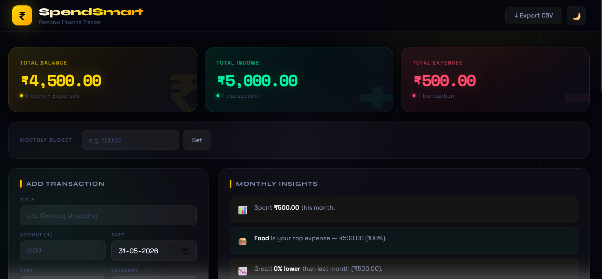
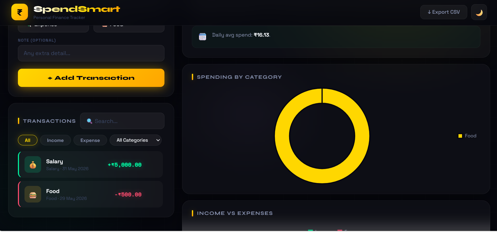
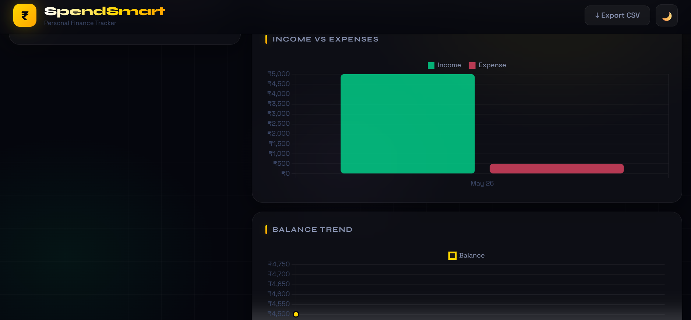

# 💰 SpendSmart — Personal Finance Tracker

A full-stack personal finance tracker with authentication, real-time budget analytics, and interactive charts.

🔗 **Live Demo:** [spend-smart-pi.vercel.app](https://spend-smart-pi.vercel.app)

---

## 🛠 Tech Stack

**Frontend**
- React 19 + Vite
- Firebase Authentication
- Chart.js (Doughnut, Bar, Line charts)
- Axios

**Backend**
- Node.js + Express.js
- MongoDB Atlas + Mongoose
- REST API

**Deployment**
- Frontend → Vercel
- Backend → Railway

---

## ✨ Features

- 🔐 User Authentication (Login / Signup via Firebase)
- ➕ Add, Edit, Delete transactions
- 📊 Interactive charts — spending by category, income vs expenses, balance trend
- 💰 Monthly budget tracking with alerts
- 🔍 Search and filter by type/category
- 📈 Smart monthly insights
- 📤 Export transactions to CSV
- 📱 Responsive design

---

## 🏗 Architecture

```
SpendSmart/
├── client/          # React + Vite frontend (Vercel)
│   └── src/
│       ├── App.jsx
│       └── firebase.js
└── server/          # Node.js + Express backend (Railway)
    ├── server.js
    ├── routes/
    │   └── transactionRoutes.js
    └── models/
        └── Transaction.js
```

---

## 🚀 Run Locally

**Backend:**
```bash
cd server
npm install
# Add .env file with MONGO_URI and PORT
node server.js
```

**Frontend:**
```bash
cd client
npm install
npm run dev
```

---

## 📸 Screenshots

### Dashboard Overview


### Expense Analytics


### Income & Expense Report


---

## 👩‍💻 Author

**Palak Agrawal**


